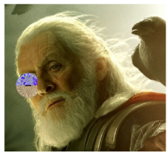

# O.D.I.N (Ocular Direction Instead of Noise)

_Winner of Best AR/VR Hack, and 3rd place overall @ [HackUMass 7](https://dashboard.hackumass.com/projects/31)_

## [Matrix Creator](https://matrix-io.github.io/matrix-documentation/matrix-creator/overview/)
The MATRIX Creator is a hatter for the raspberry pi featureing 11 different types of sensors including an array of 8 microphones. 

## [Odin Web](https://github.com/introlab/odas/wiki)
ODAS (Open embeddeD Audition System) performs sound source localization, tracking, separation and post-filtering.

To run ODIN Web, first do `cd OdinWeb`, then run `npm install` to install required dependencies
When you are ready and the device is ready to send over data, run `npm start` and the Electron application should build.

## [IBM MAX Audio Classifier](https://developer.ibm.com/exchanges/models/all/max-audio-classifier/)
IBM MAX Audio Classifier is used to classify sound bites. The model supports 527 different classes, and was trained on the Google AudioSet.

Python Example:
~~~python
  url = "http://max-audio-classifier.max.us-south.containers.appdomain.cloud/model/predict?start_time=0"
  response = requests.post(url, files={"audio": open("audio_file.wav", "rb")})
~~~
API respondse:
~~~json
{
    "status": "ok",
    "predictions": [
        {
            "label_id": "/m/06mb1",
            "label": "Rain",
            "probability": 0.7376469373703003
        },
        {
            "label_id": "/m/0ngt1",
            "label": "Thunder",
            "probability": 0.60517817735672
        },
        {
            "label_id": "/t/dd00038",
            "label": "Rain on surface",
            "probability": 0.5905200839042664
        }
    ]
}
~~~

## Augmented Relaity Directional Display
Using microphone wavelet data from the MATRIX Creator, and ARCore, The Augmented Reality Directional Display is able to allow users to view exactly which direction their sound is coming from. 

## Why Odin?
Odin is the Norse God in Greek Mythology with the "All Seeing Eye". We drew inspiration from Odin by giving our users an 'all seeing eye' by enhancing their vision with audio information through AR technology.

